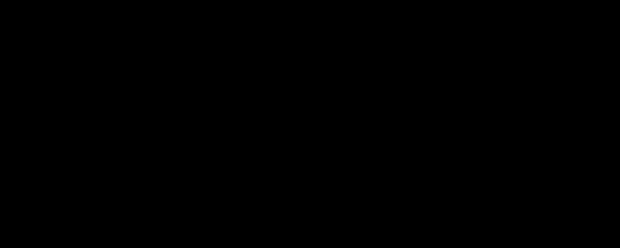

# KeyZ — animación de logo



Wordmark animado: arranca como **KZ** y la `K` y la `Z` se separan destapando la `e` y la `y`, hasta quedar **KeyZ** en grande.

Un solo archivo, sin dependencias ni fuentes externas (usa la system font). Click o `Espacio` para repetir.

**Demo en vivo:** https://nachoestevo.github.io/keyz-animation/

## Cómo funciona

La `e` y la `y` no aparecen ni se mueven: están siempre en su posición final, tapadas por un `clip-path`. Lo que se anima es el `translateX` de la `K` y la `Z`, y el borde de cada máscara viaja pegado al canto de la letra que la destapa.

Dos detalles que hacen que calce:

- **El recorrido de la máscara y el de la letra tienen que ser iguales.** Si la máscara viaja de más, destapa la letra antes de que pase la `K`.
- **Con `letter-spacing` negativo la caja de la letra queda más angosta que el glifo**, así que la tinta se sale (la `y` se pasa ~8px por la derecha, justo el lado que barre la `Z`). Por eso los extremos del `clip-path` se calculan en runtime midiendo la tinta real con `measureText().actualBoundingBox`, más un colchón para el antialias. Ese sobrante va solo a la máscara: si se le suma también al recorrido de la letra, la `KZ` inicial se pisa.

Los insets verticales del `clip-path` son negativos, así la máscara recorta solo a los costados y la cola de la `y` nunca se corta.

## Ajustes

Al principio del `<style>`:

| Variable | Qué hace |
| --- | --- |
| `--sep-dur` | Duración de la separación |
| `--sep-delay` | Cuánto se sostiene el momento "KZ" |
| `--ease` | Curva de la animación |

El tamaño está en `.wordmark { font-size }` y el peso en `font-weight`.

## Uso local

```sh
python3 -m http.server 4321
```
